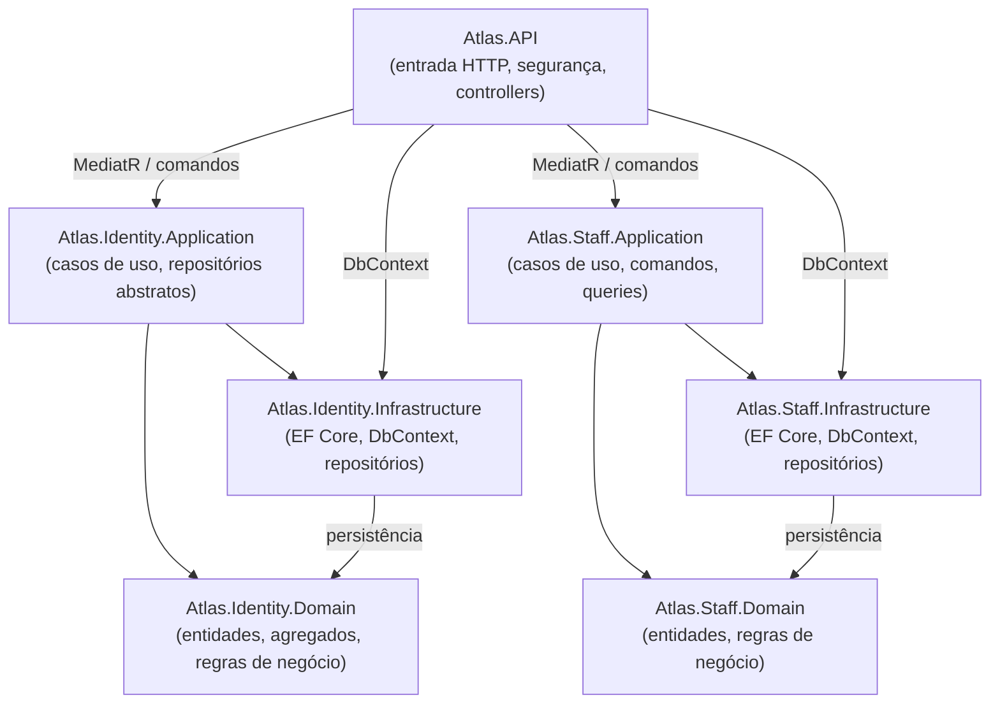
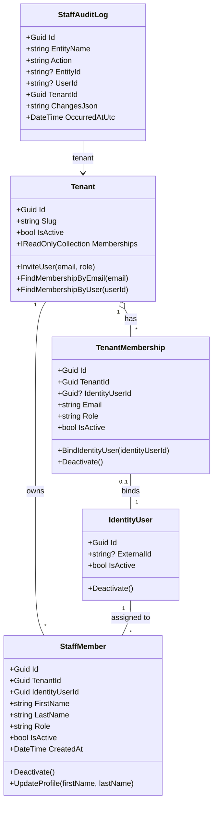
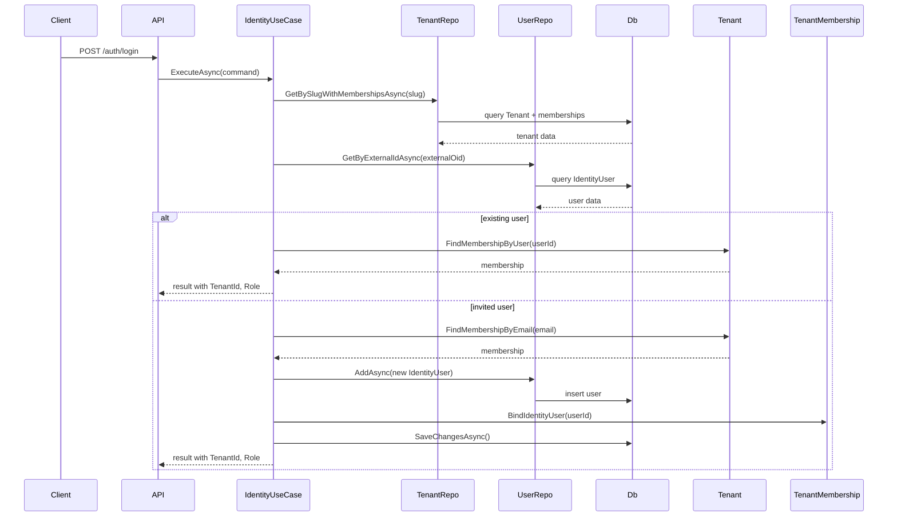

# Diagramas de Arquitetura

## 1. Visão de alto nível do sistema

```mermaid
flowchart TD
    API["Atlas.API\n(entrada HTTP, segurança, controllers)"]
    IdentityApp["Atlas.Identity.Application\n(casos de uso, repositórios abstratos)"]
    IdentityDomain["Atlas.Identity.Domain\n(entidades, agregados, regras de negócio)"]
    IdentityInfra["Atlas.Identity.Infrastructure\n(EF Core, DbContext, repositórios)"]
    StaffApp["Atlas.Staff.Application\n(casos de uso, comandos, queries)"]
    StaffDomain["Atlas.Staff.Domain\n(entidades, regras de negócio)"]
    StaffInfra["Atlas.Staff.Infrastructure\n(EF Core, DbContext, repositórios)"]

    API -->|MediatR / comandos| IdentityApp
    API -->|MediatR / comandos| StaffApp
    IdentityApp --> IdentityDomain
    IdentityApp --> IdentityInfra
    StaffApp --> StaffDomain
    StaffApp --> StaffInfra
    IdentityInfra -->|persistência| IdentityDomain
    StaffInfra -->|persistência| StaffDomain
    API -->|DbContext| IdentityInfra
    API -->|DbContext| StaffInfra
``` 

## 2. Modelo de domínio (Identity x Staff)

```mermaid
classDiagram
    class Tenant {
        +Guid Id
        +string Slug
        +bool IsActive
        +IReadOnlyCollection<TenantMembership> Memberships
        +InviteUser(email, role)
        +FindMembershipByEmail(email)
        +FindMembershipByUser(userId)
    }

    class TenantMembership {
        +Guid Id
        +Guid TenantId
        +Guid? IdentityUserId
        +string Email
        +string Role
        +bool IsActive
        +BindIdentityUser(identityUserId)
        +Deactivate()
    }

    class IdentityUser {
        +Guid Id
        +string? ExternalId
        +bool IsActive
        +Deactivate()
    }

    class StaffMember {
        +Guid Id
        +Guid TenantId
        +Guid IdentityUserId
        +string FirstName
        +string LastName
        +string Role
        +bool IsActive
        +DateTime CreatedAt
        +Deactivate()
        +UpdateProfile(firstName, lastName)
    }

    class StaffAuditLog {
        +Guid Id
        +string EntityName
        +string Action
        +string? EntityId
        +string? UserId
        +Guid TenantId
        +string ChangesJson
        +DateTime OccurredAtUtc
    }

    Tenant "1" o-- "*" TenantMembership : has
    TenantMembership "0..1" -- "1" IdentityUser : binds
    Tenant "1" -- "*" StaffMember : owns
    IdentityUser "1" -- "*" StaffMember : assigned to
    StaffAuditLog --> Tenant : tenant
``` 

## 3. Fluxo de autorização de login

```mermaid
sequenceDiagram
    participant Client
    participant API
    participant IdentityUseCase
    participant TenantRepo
    participant UserRepo
    participant Db

    Client->>API: POST /auth/login
    API->>IdentityUseCase: ExecuteAsync(command)
    IdentityUseCase->>TenantRepo: GetBySlugWithMembershipsAsync(slug)
    TenantRepo->>Db: query Tenant + memberships
    Db-->>TenantRepo: tenant data
    IdentityUseCase->>UserRepo: GetByExternalIdAsync(externalOid)
    UserRepo->>Db: query IdentityUser
    Db-->>UserRepo: user data
    alt existing user
      IdentityUseCase->>Tenant: FindMembershipByUser(userId)
      Tenant-->>IdentityUseCase: membership
      IdentityUseCase-->>API: result with TenantId, Role
    else invited user
      IdentityUseCase->>Tenant: FindMembershipByEmail(email)
      Tenant-->>IdentityUseCase: membership
      IdentityUseCase->>UserRepo: AddAsync(new IdentityUser)
      UserRepo->>Db: insert user
      IdentityUseCase->>TenantMembership: BindIdentityUser(userId)
      IdentityUseCase->>Db: SaveChangesAsync()
      IdentityUseCase-->>API: result with TenantId, Role
    end
``` 
