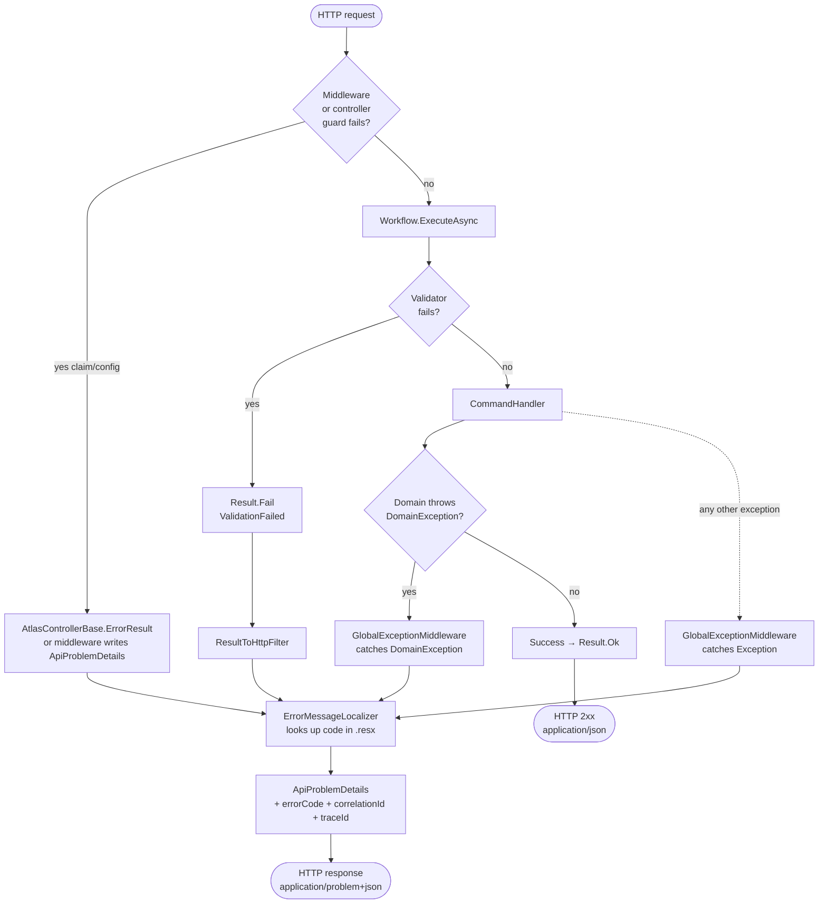
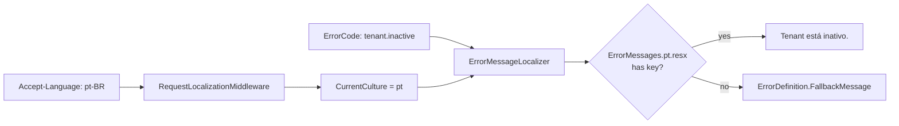

# Error Handling

Every error in Atlas — from a missing claim to an aggregate invariant violation — funnels through a **single shape** (`ApiProblemDetails`) and a **single localization mechanism** (`ErrorMessageLocalizer` + `.resx`).

This doc shows where errors originate and how they reach the client.

---

## Decision tree



---

## The four error sources

### 1. Controller / middleware guard (pre-domain)

A controller or middleware can reject a request before it reaches any domain code — missing claim, unknown tenant in config, malformed input that doesn't make it to a Validator.

```csharp
// In a controller extending AtlasControllerBase
if (string.IsNullOrWhiteSpace(tenant))
    return ErrorResult(AuthErrors.Tenant.NameRequired);
```

`ErrorResult(ErrorDefinition)` localizes the message, maps the `ErrorCategory` to an HTTP status, and returns a structured `ApiProblemDetails`.

In middleware, `WriteProblemAsync(context, AuthErrors.X, localizer)` does the same.

### 2. Workflow validator (input validation)

FluentValidation runs at the start of every Workflow. On failure:

```csharp
var validation = await _validator.ValidateAsync(cmd, ct);
if (!validation.IsValid)
    return Result.Fail<Output>(validation.ToErrorDefinition());
```

`ResultToHttpFilter` converts `Result.Fail` → `400 ApiProblemDetails`.

### 3. Domain exception (invariant violation)

The domain throws `DomainException` (every concrete exception carries an `ErrorCode` const and an `ErrorCategory`):

```csharp
public sealed class TenantInactiveException : DomainException
{
    public const string ErrorCode = "tenant.inactive";
    public TenantInactiveException()
        : base(ErrorCode, ErrorCategory.Business, "Tenant is inactive.") { }
}
```

`GlobalExceptionMiddleware` catches it, logs a **warning** (it's an expected business condition, not a bug), and translates it:

```csharp
catch (DomainException ex)
{
    _logger.LogWarning(ex, "Domain exception: {ErrorCode}", ex.ErrorCode);
    var error = new ErrorDefinition(ex.ErrorCode, ex.Message, ex.Category);
    // → ApiProblemDetails with status from MapCategory(ex.Category)
}
```

### 4. Unhandled exception

Anything else — null reference, DB timeout, third-party failure. `GlobalExceptionMiddleware` catches it, logs an **error**, and returns `CommonErrors.Unexpected` (500). The original message is **not** sent to the client.

---

## Category → HTTP status mapping

A single mapping used everywhere (`AtlasControllerBase`, `GlobalExceptionMiddleware`, `UserBootstrapMiddleware`):

| `ErrorCategory` | HTTP status |
|---|---|
| `Validation` | 400 Bad Request |
| `Unauthorized` | 401 Unauthorized |
| `NotFound` | 404 Not Found |
| `Conflict` | 409 Conflict |
| `Business` | 422 Unprocessable Entity |
| `Unexpected` | 500 Internal Server Error |

---

## Response shape

Every error response is `application/problem+json` with this shape:

```json
{
  "type": "https://docs.atlas/errors/tenant.inactive",
  "title": "Tenant está inativo.",
  "status": 422,
  "detail": "Tenant is inactive.",
  "errorCode": "tenant.inactive",
  "correlationId": "f4c8d3...",
  "traceId": "00-abc123...",
  "timestamp": "2026-05-17T14:23:01Z"
}
```

- `title` — localized message (from `.resx`, based on `Accept-Language`)
- `detail` — technical message (English, useful for logs)
- `errorCode` — stable identifier the frontend can switch on
- `correlationId` — same id used in server logs (search by this to find the request)

---

## Localization mechanism



The `ErrorCode` is the contract between domain code and translation files. Adding a new error means:

1. Add `public const string ErrorCode = "..."` to a new exception class
2. Reference it in the relevant error catalog (`IdentityErrors`, `AuthErrors`, etc.)
3. Add the key to `ErrorMessages.resx` (en) and `ErrorMessages.pt.resx` (pt)

If a translation is missing, the fallback message (English, defined in the catalog) is returned — never an empty title.

---

## Why exceptions in the domain, but `Result` at the boundary

This is a deliberate architectural rule:

- **Domain throws.** Inside an aggregate, invariant violations are exceptional and rare. Returning `Result` from every method would clutter the domain language. We *want* `tenant.ResolveAccess(oid, email)` to read like a sentence, not a chain of error-handling.
- **Workflow returns `Result<T>`.** The workflow is the boundary between domain and HTTP. It's where errors become *data* — categorized, localized, mapped to status codes. The HTTP layer should never see a raw exception (except as a bug).

The `GlobalExceptionMiddleware` enforces this by catching `DomainException` and converting it to the same `ApiProblemDetails` shape that `ResultToHttpFilter` produces. From the client's perspective, **all errors look the same regardless of origin**.
