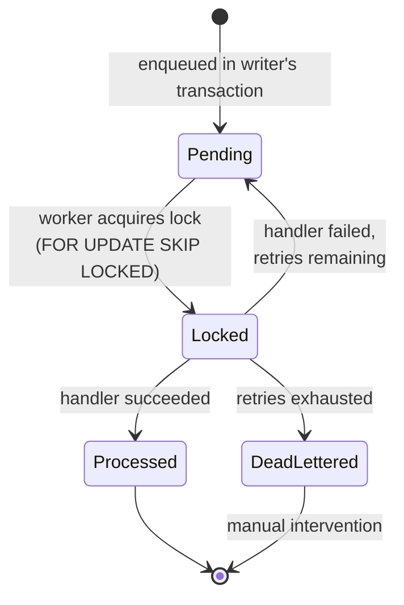

# Outbox Integration

How a domain event in one module becomes a method call in another — reliably, atomically, exactly once.

---

## Why the outbox pattern

Naive approach (broken): when a domain event fires, immediately call the other module's handler in-process.

Problems:
- If the handler fails, the database commit still happened → inconsistent state
- If the handler succeeds but the commit fails → handler ran for nothing
- Cross-module call is synchronous coupling → one module's failure cascades

**The outbox solves it:** the integration event is persisted as a row in the **same transaction** as the domain change. A separate process picks it up later. Either both commit, or neither — guaranteed by the database.

---

## End-to-end flow

```mermaid
sequenceDiagram
    autonumber
    participant WF as Workflow (writer module)
    participant Agg as Aggregate
    participant UoW as UnitOfWork
    participant Enq as IntegrationEventEnqueuer
    participant DB as PostgreSQL<br/>(domain + outbox tables)
    participant W as OutboxWorker
    participant Disp as Dispatcher
    participant H as IIntegrationEventHandler&lt;T&gt;<br/>(reader module)

    WF->>Agg: aggregate.Operation(...)
    Agg->>Agg: AddDomainEvent(...)
    WF->>UoW: SaveChangesAsync()

    UoW->>Enq: EnqueueAsync(domainEvents)
    Enq->>Enq: map domain event → integration event
    Enq->>DB: add OutboxMessage row (state: Pending)
    UoW->>DB: COMMIT (domain + outbox atomic)

    Note over DB,W: ⏳ time passes...

    W->>DB: SELECT FOR UPDATE SKIP LOCKED<br/>WHERE processed_on IS NULL<br/>AND dead_lettered_on IS NULL<br/>LIMIT N
    DB-->>W: batch of N messages (now Locked)
    W->>Disp: dispatch(message)
    Disp->>Disp: resolve handler type by name
    Disp->>H: HandleAsync(integrationEvent)
    H->>H: business logic (in reader module)
    H-->>Disp: ok / throws
    alt success
        W->>DB: UPDATE processed_on = NOW()
    else failure (retries < max)
        W->>DB: UPDATE retry_count++, locked_until = NULL
    else failure (retries >= max)
        W->>DB: UPDATE dead_lettered_on = NOW()
    end
```

---

## Message state machine



| State | Column |
|---|---|
| Pending | `processed_on IS NULL AND dead_lettered_on IS NULL AND (locked_until IS NULL OR locked_until < NOW())` |
| Locked | `locked_until > NOW()` |
| Processed | `processed_on IS NOT NULL` |
| DeadLettered | `dead_lettered_on IS NOT NULL` |

---

## Why `FOR UPDATE SKIP LOCKED`

Two workers running in parallel must never process the same message. PostgreSQL's `FOR UPDATE SKIP LOCKED` gives us this for free:

- Worker A locks rows 1-10 → starts processing
- Worker B's query **skips** rows 1-10 → locks rows 11-20

No coordination needed between workers. Horizontal scale is automatic — add another worker process and throughput scales linearly until the database is the bottleneck.

---

## What's actually stored

```
OutboxMessage
├─ Id          : Guid
├─ Name        : string         ← integration event name (e.g. "UserCreatedFromInvitation")
├─ Type        : string         ← assembly-qualified type for the dispatcher
├─ Payload     : jsonb          ← serialized integration event
├─ Module      : string         ← writer module (Identity / Staff)
├─ TenantId    : Guid?          ← for tenant-scoped processing
├─ UserId      : Guid?
├─ CorrelationId : string?      ← carried from the originating HTTP request
├─ OccurredOn  : timestamp
├─ ProcessedOn : timestamp?     ← null = not processed
├─ LockId      : Guid?          ← per-batch lock identifier
├─ LockedUntil : timestamp?     ← when the lock expires
├─ RetryCount  : int
├─ Error       : string?        ← last error message
└─ DeadLetteredOn : timestamp?  ← null unless we gave up
```

---

## Atomicity guarantee — the part that matters

Look at this code path inside `IdentityUnitOfWork.SaveChangesAsync`:

```csharp
public async Task SaveChangesAsync(CancellationToken ct)
{
    var domainEvents = _db.GetDomainEvents();
    await _integrationEventEnqueuer.EnqueueAsync(domainEvents, ct); // adds outbox rows
    await _auditService.AddAuditLogsAsync(_db, ct);
    await _db.SaveChangesAsync(ct);                                  // ONE transaction
    _db.ClearDomainEvents();
}
```

Everything — domain entity changes, outbox rows, audit rows — is sent in a single EF Core `SaveChangesAsync`. EF Core wraps that in a single database transaction. **There is no window where the domain changed but the outbox didn't, or vice versa.**

---

## Failure modes and how they're handled

| Failure | What happens |
|---|---|
| Writer commits but worker crashes before processing | Message stays `Pending` → next worker picks it up |
| Worker locks a row then crashes mid-processing | `locked_until` expires → row goes back to `Pending` |
| Handler throws transient error | `retry_count++`, message returns to `Pending` |
| Handler throws every time | After max retries → `DeadLettered`, requires investigation |
| Two workers race for the same row | PostgreSQL's `SKIP LOCKED` guarantees only one wins |
| Worker is killed between dispatching and updating state | Lock expires → another worker re-processes (handler must be idempotent) |

**Implication for handlers: they must be idempotent.** A handler can be invoked twice for the same message if a worker dies after dispatching but before marking processed. Design accordingly — typically by checking "does the entity already exist?" before creating.
