# Request Lifecycle

What happens between an HTTP request hitting the API and a JSON response coming back.

This is **the** doc to read first. Every other flow is a specialization of this one.

---

## End-to-end sequence

```mermaid
sequenceDiagram
    autonumber
    participant C as Client
    participant MW as Middlewares
    participant Ctrl as Controller
    participant WF as Workflow
    participant V as Validator
    participant CH as CommandHandler
    participant D as Domain (Aggregate)
    participant UoW as UnitOfWork
    participant DB as PostgreSQL

    C->>MW: HTTP request<br/>(cookie + Accept-Language)
    Note over MW: HSTS · HTTPS · Localization<br/>CorrelationId · Logging<br/>SecurityHeaders · RateLimiter · CORS
    MW->>MW: Authentication (OIDC cookie)
    MW->>MW: TenantResolver<br/>(claims → TenantId)
    MW->>MW: UserBootstrap<br/>(first login only)
    MW->>MW: Authorization
    MW->>Ctrl: HttpContext (User + Tenant)

    Ctrl->>WF: ExecuteAsync(Command, ct)

    WF->>V: ValidateAsync(Command)
    alt validation fails
        V-->>WF: ValidationResult (invalid)
        WF-->>Ctrl: Result.Fail(ValidationFailed)
    else valid
        V-->>WF: ValidationResult (valid)
        WF->>CH: ExecuteAsync(Command, ct)
        CH->>D: aggregate.Operation(...)
        D-->>CH: Output<br/>(throws DomainException on invariant)
        CH-->>WF: Output

        WF->>UoW: SaveChangesAsync(ct)
        UoW->>UoW: Enqueue outbox messages<br/>from domain events
        UoW->>UoW: Add audit log rows
        UoW->>DB: Single EF transaction
        DB-->>UoW: ok

        WF-->>Ctrl: Result.Ok(Output)
    end

    Ctrl-->>MW: IActionResult / Result&lt;T&gt;
    Note over MW: ResultToHttpFilter maps Result → HTTP<br/>(ErrorMessageLocalizer for failures)
    MW-->>C: JSON response (or ApiProblemDetails)
```

---

## Middleware pipeline order

The order matters — each step depends on the previous one.

```mermaid
flowchart LR
    HSTS --> HTTPS --> Loc[RequestLocalization] --> Corr[CorrelationId]
    Corr --> Log[Serilog] --> Ex[GlobalException] --> Sec[SecurityHeaders]
    Sec --> Rate[RateLimiter] --> CORS --> Auth[Authentication]
    Auth --> Tenant[TenantResolver] --> Boot[UserBootstrap] --> Authz[Authorization]
    Authz --> EP[Endpoint / Controller]
```



| Middleware | Why this position |
|---|---|
| `RequestLocalization` | Must run before anything that produces user-facing text (errors are localized) |
| `CorrelationIdMiddleware` | Earlier than logging so every log line carries the correlation id |
| `GlobalExceptionMiddleware` | Wraps everything below — catches `DomainException` and unhandled exceptions |
| `Authentication` | Sets `HttpContext.User` from the OIDC cookie |
| `TenantResolverMiddleware` | Needs `HttpContext.User` populated to read claims |
| `UserBootstrapMiddleware` | Needs the tenant resolved to run `ResolveTenantAccess` |
| `Authorization` | Runs after bootstrap so policies see the full claim set (including internal `tenant_id`, `user_id`) |

---

## Layer responsibilities

| Layer | What it does | What it does **not** do |
|---|---|---|
| **Middleware** | Cross-cutting: auth, tenant, logging, errors, i18n | Business logic |
| **Controller** | Parse HTTP → call workflow → return `IActionResult` | Validation, persistence, error mapping (those happen elsewhere) |
| **Workflow** | Orchestrate: validate → execute command → save → wrap in `Result<T>` | Domain logic |
| **CommandHandler** | Load aggregate, call domain method, return `Output` | Validation, `Result` wrapping, transaction commit |
| **Domain aggregate** | Enforce invariants, raise domain events, return values | Persistence, transactions, external calls |
| **UnitOfWork** | Atomic commit: domain changes + outbox + audit in one transaction | Business decisions |

A clean rule of thumb: **only the Workflow produces `Result<T>`. Only the Domain throws `DomainException`. Only the UoW touches transactions.**

---

## Where things can fail (and what the client sees)

| Failure point | Mechanism | Client gets |
|---|---|---|
| Validator returns invalid | `Result.Fail(ValidationFailed)` | `400 ApiProblemDetails` (`validation.failed`) |
| Domain aggregate throws | `DomainException` → `GlobalExceptionMiddleware` | `4xx/422 ApiProblemDetails` (code from exception) |
| Repository returns null → handler throws | Same as above (e.g. `TenantNotFoundException`) | `404 ApiProblemDetails` |
| Controller guard fails (missing claim, bad tenant config) | `ErrorResult(AuthErrors.X)` from `AtlasControllerBase` | `400/401 ApiProblemDetails` |
| Anything else throws | `GlobalExceptionMiddleware` → `CommonErrors.Unexpected` | `500 ApiProblemDetails` |

See [`error-handling.md`](error-handling.md) for the full decision tree.
