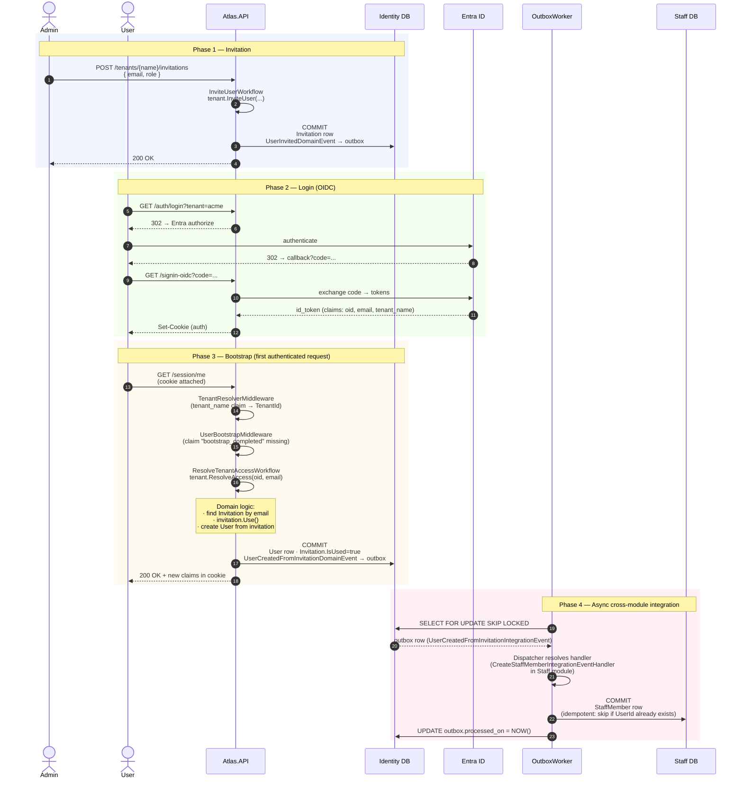

# User Onboarding — End-to-End

The most important concrete flow in Atlas. Crosses both modules and exercises every architectural pattern.

**Scenario:** an admin invites a new person to a tenant. The person logs in via Entra ID. Atlas creates the User in Identity and reactively creates the StaffMember in Staff.

---

## The full picture

---

## What just happened, in plain English

1. **Invitation phase.** Admin sends an invitation. Identity persists an `Invitation` row. A domain event fires, but no integration event yet — Staff doesn't care about pending invitations.

2. **Login phase.** User completes the OIDC dance with Entra ID. Atlas just trusts the resulting cookie — no domain state changes yet. The user has a session, but Atlas hasn't yet looked up "who is this person in our domain?".

3. **Bootstrap phase.** First real request after login. `UserBootstrapMiddleware` notices the user hasn't been bootstrapped (no internal `bootstrap_completed` claim) and runs `ResolveTenantAccessWorkflow`. This is where the magic happens:
   - The Tenant aggregate is loaded with its Invitations and Users.
   - `tenant.ResolveAccess(oid, email)` finds the matching invitation, marks it used, creates the User.
   - Domain events are emitted. `IntegrationEventEnqueuer` maps `UserCreatedFromInvitationDomainEvent` → integration event → outbox row.
   - **Single transaction:** User created, Invitation used, outbox row written. All or nothing.
   - The middleware appends internal claims (TenantId, UserId, Role, `bootstrap_completed=true`) to the cookie. Future requests skip bootstrap.

4. **Integration phase.** `Atlas.OutboxWorker` (a separate process) polls Identity's outbox table. It finds the row, dispatches to the `CreateStaffMemberIntegrationEventHandler` in the Staff module, which creates a `StaffMember` linked by `UserId`. The handler is **idempotent** — if the StaffMember already exists, it skips.

---

## Why this design is robust

| Concern | How it's addressed |
|---|---|
| What if the user closes the browser between login and bootstrap? | Cookie persists. Next request hits bootstrap. No state lost. |
| What if Identity commits but the worker dies before creating StaffMember? | Outbox row stays Pending. Another worker (or restarted one) picks it up. |
| What if the worker dispatches but Staff DB is down? | Handler throws → retry. After max retries → dead-letter for manual review. |
| What if the user logs in twice during bootstrap? | `tenant.ResolveAccess()` finds the existing user on the second call and returns it. Idempotent at the domain level. |
| What if a different OID tries to log in with the same email? | `ResolveAccess` throws `UserAlreadyExistsException` — blocks impersonation. |
| What if the invitation expired? | `ResolveAccess` throws `InvitationExpiredException` → middleware returns 401 with localized message. |

---

## Files involved (for the curious)

| Phase | Key files |
|---|---|
| Invitation | `Atlas.Identity.Application/Tenants/Workflows/InviteUser/*` |
| Login | `Atlas.API/Security/Oidc/OidcMultiTenantConfigurator.cs` |
| Bootstrap | `Atlas.API/Security/Bootstrap/UserBootstrapMiddleware.cs` + `Atlas.Identity.Application/Tenants/Workflows/ResolveTenantAccess/*` |
| Integration | `Atlas.OutboxWorker/Processing/OutboxProcessor.cs` + `Atlas.Staff.Application/IntegrationEventHandlers/CreateStaffMemberIntegrationEventHandler.cs` |
