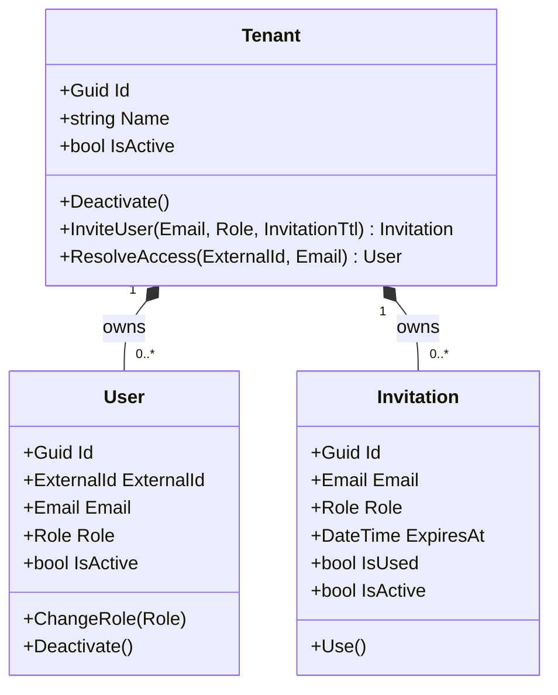

# Identity Module

The Identity module owns **tenants, users, and invitations**. It is the source of truth for "who can access this system, on behalf of which tenant".

It does **not** manage credentials — authentication is delegated to an external OIDC provider (Microsoft Entra ID). Identity only maps the *external identity* (`ExternalId`) to an *internal user* within a `Tenant`.

---

## Domain model

- `Tenant` is the **aggregate root** — all writes flow through it.
- `User` and `Invitation` are entities **inside** the Tenant aggregate. They never exist on their own and are accessed via `tenant.Users` / `tenant.Invitations`.

---

## Value objects

| VO | Validation |
|---|---|
| `Email` | non-empty, valid format, normalized to lowercase + trimmed |
| `Role` | one of `admin`, `member`, `owner`; normalized |
| `ExternalId` | non-empty; case-sensitive (opaque IdP identifier) |
| `InvitationTtl` | between 1 second and 30 days |

Each VO throws its own `Invalid*Exception` (with `ErrorCode` const) on bad input.

---

## Invariants

Enforced inside the Tenant aggregate:

1. A tenant **must be active** to invite users or resolve access (`TenantInactiveException`).
2. A tenant **cannot have two users with the same email** (`UserAlreadyExistsException`).
3. A tenant **cannot have two active invitations for the same email** (`DuplicateInvitationException`).
4. A user **must be created from a valid, non-expired, unused invitation** (`InvitationNotFoundException`, `InvitationExpiredException`).
5. If an email already maps to a user, **the OID must match** — otherwise we treat it as a different identity and reject (`UserAlreadyExistsException`). This blocks impersonation.

---

## Domain events

Emitted by Tenant during lifecycle operations:

| Event | When |
|---|---|
| `TenantDeactivatedDomainEvent` | `Deactivate()` succeeds |
| `UserInvitedDomainEvent` | `InviteUser()` succeeds |
| `InvitationUsedDomainEvent` | `ResolveAccess()` consumes an invitation |
| `UserCreatedFromInvitationDomainEvent` | A new user is created from an invitation — **mapped to an integration event** consumed by Staff |
| `UserAccessResolvedDomainEvent` | `ResolveAccess()` returns an existing or newly-created user |

---

## Application layer

| Element | Purpose |
|---|---|
| `IResolveTenantAccessWorkflow` | Entry point used by `UserBootstrapMiddleware` after OIDC login |
| `ResolveTenantAccess.Command/Handler/Validator` | Looks up the tenant, calls `tenant.ResolveAccess(...)` |
| `ITenantRepository` | Loads Tenant with Users + Invitations eagerly |
| `IIdentityUnitOfWork` | Commits the EF Core transaction *and* enqueues outbox messages atomically |
| `IdentityErrors` | Error catalog — codes reference `Exception.ErrorCode` constants |

---

## Integration events published

| Event | Consumer |
|---|---|
| `UserCreatedFromInvitationIntegrationEvent` | Staff module (`CreateStaffMemberIntegrationEventHandler`) |

See [`flows/user-onboarding.md`](../../flows/user-onboarding.md) for the full cross-module flow.

---

## Where to go next

- **Add a new domain operation?** Read the [Domain Design Playbook](../../guidelines/domain-design-playbook.md) first.
- **Add a new error?** See the [error-catalog-and-i18n pattern](../../patterns/error-catalog-and-i18n.md) (Wave 3).
- **API reference (auto-generated):** [Identity Domain API](../../api/identity/)
