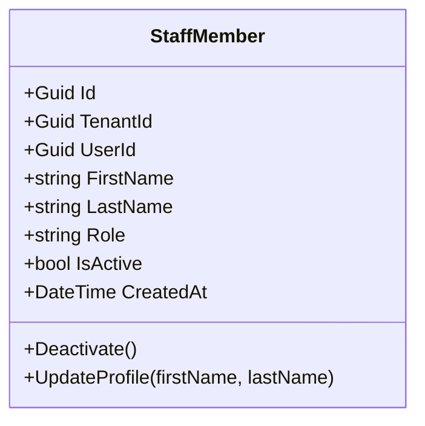

# Staff Module

The Staff module manages **staff members** within a tenant. It is a **reactive consumer** of the Identity module: every time Identity creates a user, Staff creates a corresponding staff member.

The two modules **never call each other directly**. The integration is asynchronous, via the outbox.

---

## Domain model

- `StaffMember` is the aggregate. There are no child entities today.
- `UserId` links back to the `User.Id` in the Identity module — this is the **only** coupling between modules, and it's just a Guid (no foreign key, no cross-context query).
- `TenantId` enforces multi-tenant isolation (filtered by `MultiTenantDbContext`).

---

## Application layer

| Element | Purpose |
|---|---|
| `StaffMembers.Commands.Create.Command/Handler/Validator` | Creates a `StaffMember` — invoked by the integration event handler, not directly by HTTP |
| `StaffMembers.Queries.List.Query/Handler/Reader` | Lists staff members for the current tenant (CQRS read side) |
| `IStaffMemberRepository` | Persistence interface |
| `IStaffUnitOfWork` | Commits writes + outbox atomically |
| `IListStaffMembersReader` | Read-optimized projection — bypasses the aggregate for query performance |
| `StaffErrors` | Error catalog |

---

## Integration events consumed

| Event source | Handler | Effect |
|---|---|---|
| `UserCreatedFromInvitationIntegrationEvent` (from Identity) | `CreateStaffMemberIntegrationEventHandler` | Creates a `StaffMember` with `UserId` = the new user's id, `Role` from the invitation |

The handler is invoked by `Atlas.OutboxWorker`, not by the HTTP pipeline. See [`flows/outbox-integration.md`](../../flows/outbox-integration.md).

---

## HTTP surface

- `GET /staff` — list staff members for the current tenant
- (Create is **not** exposed via HTTP — creation only happens reactively via the integration event)

---

## Where to go next

- **Add a new query?** Use the read-side pattern in `Queries.List` (Reader interface, projection DTO) — bypass the aggregate.
- **Add a new write operation?** Use the existing `Commands.Create` as a template — Validator → Handler → UoW.
- **API reference (auto-generated):** [Staff Domain API](../../api/staff/)
