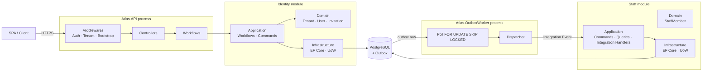
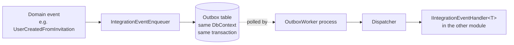

# Atlas — System Overview

Atlas is a **modular monolith** in .NET 10 designed around three goals:

1. **Clear bounded contexts.** Each module (Identity, Staff) is self-contained — its own domain, application, infrastructure layers.
2. **Async-only integration between modules.** Modules never call each other directly. They communicate through the **outbox pattern**.
3. **Multi-tenant by design.** Every domain entity is scoped to a `TenantId`, resolved from the authenticated user's OIDC claims.

---

## Architecture at a glance

---

## Layered structure (per module)

Every module follows the same Clean Architecture layering:

| Layer | Responsibility | Knows about |
|---|---|---|
| **Domain** | Entities, aggregates, value objects, invariants, domain events | Nothing — pure C# |
| **Application** | Workflows, commands, validators, repository *interfaces* | Domain |
| **Infrastructure** | EF Core, UoW, repository implementations, migrations, seeders | Domain + Application |
| **API** (shared) | HTTP, middlewares, OIDC, controllers | All modules' Application |

**Dependency rule:** Domain ← Application ← Infrastructure ← API. Never the reverse.

---

## Inter-module communication

Key property: the domain change and the outbox row are written in the **same EF Core transaction**. Either both commit or neither — no lost events, no orphan messages.

See [`flows/outbox-integration.md`](flows/outbox-integration.md) for the full state machine.

---

## Cross-cutting building blocks

| Package | Purpose |
|---|---|
| `Atlas.SharedKernel` | `AggregateRootBase`, `AuditableEntity`, `ValueObject`, `Result<T>`, `ErrorDefinition`, `DomainException`, outbox/integration event interfaces |
| `Atlas.BuildingBlocks.Persistence` | `MultiTenantDbContext`, `AuditService`, `OutboxMessageRepository` + EF config |
| `Atlas.BuildingBlocks.Infrastructure` | `IntegrationEventEnqueuer`, `OutboxMessageBuilder`, validation extensions |
| `Atlas.Contracts` | Integration event DTOs shared between modules |

---

## Multi-tenancy

1. User authenticates via OIDC (Microsoft Entra ID — one issuer per tenant).
2. `TenantResolverMiddleware` reads `tenant_name` claim → resolves to `TenantId`.
3. `UserBootstrapMiddleware` runs `ResolveTenantAccess` workflow on first request after login → ensures the `User` exists in Identity.
4. `IRequestContext` carries `TenantId`/`UserId` through the request.
5. `MultiTenantDbContext` applies a global query filter on `TenantId` — all queries are tenant-scoped automatically.

---

## Error handling & i18n

All errors funnel through a single shape (`ApiProblemDetails`) regardless of source:

- **Domain invariant violated** → `DomainException` (with `ErrorCode` const + `ErrorCategory`) → `GlobalExceptionMiddleware`
- **Validation failed** → `Workflow` returns `Result.Fail(ErrorDefinition)` → `ResultToHttpFilter`
- **Controller-level guard** (claims, config) → `ErrorResult(AuthErrors.X)`
- **Unhandled** → `GlobalExceptionMiddleware` → `CommonErrors.Unexpected` → 500

Messages are localized via `ErrorMessageLocalizer` reading `ErrorMessages.{culture}.resx`, keyed by `ErrorCode`. Culture is picked from `Accept-Language`.

See [`flows/error-handling.md`](flows/error-handling.md) for the decision tree.

---

## Where to go next

- **New to the codebase?** Read [`flows/request-lifecycle.md`](flows/request-lifecycle.md) — it walks a single HTTP request end-to-end.
- **Wondering how a user onboarding actually works?** [`flows/user-onboarding.md`](flows/user-onboarding.md) traces it across both modules.
- **Adding a feature?** Start at the module docs ([`modules/identity/index.md`](modules/identity/index.md) or [`modules/staff/index.md`](modules/staff/index.md)), then check the [guidelines](guidelines/).
